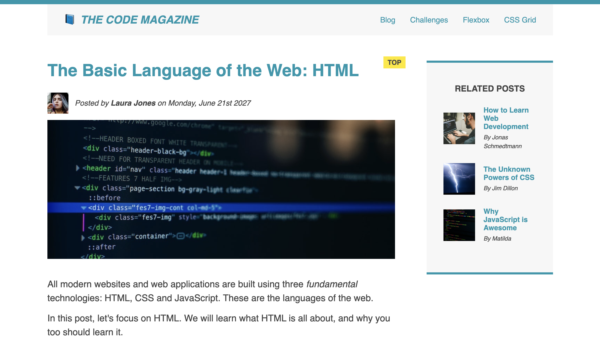

<h1 align="center">📘 THE CODE MAGAZINE</h1>

This is a project for the Code Magazine, a magazine that talks about programming and technology.

Click [here](https://blog-post-rajeev.netlify.app/) and Read this blog.

## Tech Stack

- HTML

- CSS

- CSS Flexbox

- CSS Grid

- Markdown

## Useful Links

- [Project Demo](https://blog-post-rajeev.netlify.app/) - Live Project URL

- [Project Repository](https://github.com/Rajeevjewar/Blog-Post.git)

## Need help?

Feel free to contact me on [Twitter](https://twitter.com/be_rajeevkumar) or [LinkedIn](https://www.linkedin.com/in/berajeevkumar/), know more about me at [iamrajeev.me](https://iamrajeev.me)

<h1 align=center>Happy Coding 👨‍💻</h1>

Show some ❤️&nbsp; by giving the star to this repo

